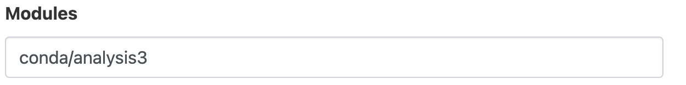
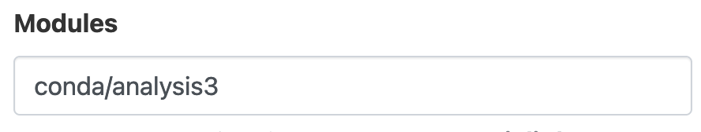

# ACCESS-NRI Training Day 2 September 2024
# Find and access datasets on NCI and handle large model output

This repository includes some material for the <a href="https://www.access-nri.org.au" target="_black">ACCESS-NRI</a> <a href="https://www.access-nri.org.au/event/access-training-day-2-september-2024/" target="_black">Training Day</a> on 2 September 2024.  
You can find a general overview of the ACCESS-NRI documentation on the <a href="https://access-hive.org.au" target="_blank">ACCESS-Hive</a>.  

We value your feedback on this training, in-person or via the <a href="https://forum.access-hive.org.au/" target="_blank">ACCESS-Hive Forum</a>, as it will help us to provide better training and documentation for the ACCESS community on our documentation portal, <a href="https://access-hive.org.au" target="_blank">ACCESS-Hive</a>.

## Structure of this repository (see <a href="https://www.access-nri.org.au/access-training-day-program/" target="_blank">Training Day program</a>)

Instructions on which NCI project you need to be part of and how to launch the <a href="https://are.nci.org.au" target="_blank">ARE</a> (Australian Research Environment) are provided below.

1. ACCESS-NRI Intake Catalog:  
   a) [Exercise: Using the ACCESS-NRI Intake catalog](intake/Intake_tutorial_p1.ipynb)  
   b) [Extra Reference Material: Indexing a new model run](intake/Intake_tutorial_p2.ipynb)


Please <a href="https://my.nci.org.au/mancini/" target="_blank">join xp65, dk92, fs38, hh5, ik11, cj50 and p73 projects</a> before the workshop - and list them in the storage instructions of your ARE session, per details below.

## Cloning this repository

For this training on Intake, you will need to clone a local copy of this repo to <i>Gadi</i> as follows: 

1. Log in to <i>Gadi</i> via the command line of your preferred terminal using your NCI username and password.

   ```bash
   ssh <your_nci_username>@gadi.nci.org.au
   ```

   Alternatively, you could use the **Gadi Terminal** web interface through the <a href="https://are.nci.org.au" target="_blank">ARE</a>.
   
2. Clone this Github repo to your user directory within `/g/data` on <i>Gadi</i>. If you have a regular project, use your folder in that project on `/g/data`. Otherwise you could create a directory for your user in `/g/data/nf33`.

   ```bash
   mkdir -p /g/data/nf33/$USER
   cd /g/data/nf33/$USER
   git clone https://github.com/ACCESS-NRI/training-day-2024-find-analyse-data.git
   ```
## Setting up an ARE JupyterLab session for the Intake tutorial notebooks
You can now start a JupyterLab session using the `nf33` project for compute resources and connecting to other projects for dependencies and data. There are instructions below for doing this using <a href="https://are.nci.org.au" target="_blank">ARE</a> but feel free to use your preferred method.

## Step 0: Pre-requisites
You should have already joined the following NCI projects: `xp65`, `hh5`, `dk92`, `fs38`, `ik11`, `cj50` and `p73`. If this is not the case, please talk to a helper.

## Step 1:
Go to the [ARE](https://are.nci.org.au/) website and log in with your **NCI username and password**.

<p align="center"></p>

## Step 2:
Click on `JupyterLab` under *Featured Apps* to configure a new JupyterLab instance. This option is also available under the *All Apps* section at the bottom of the page and the *Interactive Apps* dropdown located in the top menu.

<p align="center"></p>

## Step 3:
You will now be presented with the main JupyterLab instance configuration form. Please complete **only** the fields below - leave all other fields blank or to their default values.

- *3.1* **Walltime**: The number of hours the JupyterLab instance will run. `4` hour is sufficient for the Intake tutorials.

<p align="center"></p>

- *3.2* **Compute Size**: Select `Large (7 cpus, 32G mem)` from the dropdown menu.

<p align="center"></p>

- *3.3* **Project**: Please enter `nf33`. This will allocate SU usage to the workshop project.

<p align="center"></p>

- *3.4* **Storage**: This is the list of project data storage locations required to complete the workshop tutorials. In ARE, storage locations need to be explicitly defined to access these data from within a JupyterLab instance. Please enter the following string listing the projects mentioned in **Step 0** above: `scratch/nf33+gdata/xp65+gdata/hh5+gdata/dk92+gdata/fs38+gdata/p73`.

<p align="center"></p>

- *3.5* Click _Advanced options ..._

- *3.6* **Module directories / Modules**: There are two pubic `conda` environments that provide the software packages needed to run the tutorials, available in the projects `hh5` or `xp65`. Enter `/g/data/hh5/public/modules` into the **Module directories** field and `conda/analysis3` into the **Modules** field to use the [hh5 conda environment](http://climate-cms.wikis.unsw.edu.au/Conda#Conda_Python_Environments) <br></br>

<p align="center"></p>
<p align="center"></p>

- *3.7* Click `Launch` to start your JupyterLab instance.

<p align="center"></p>

## Step 4:
Once you have clicked `Launch` the browser will redirect to the 'interactive sessions' page where you will see your JupyterLab instance details and current status which will look something like this:

<p align="center"></p>

Once the JupyterLab instance has started (this usually takes around 30 seconds) this status window should update.

<p align="center"></p>

All that remains to get started is to click `Open JupyterLab`. This opens the instance a new browser window. Use the navigation tools in the left-hand panel to navigate to the location of the cloned tutorial files and open the tutorial notebooks.
