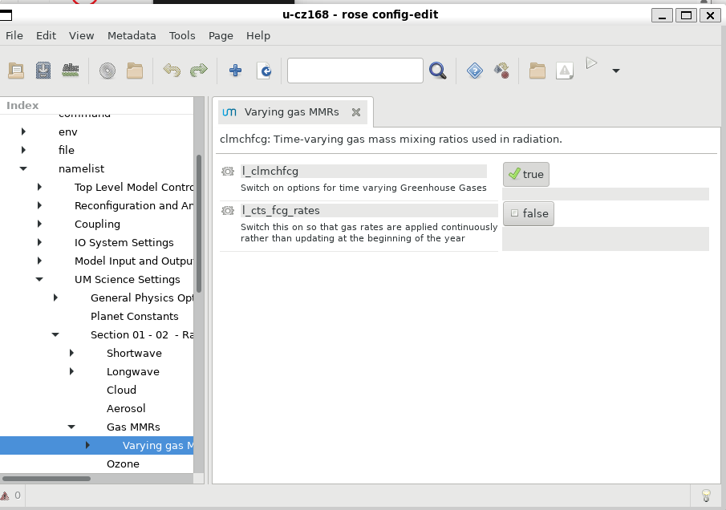

# ACCESS-NRI Workshop rose cylc examples
<p>Guide for the rose cylc ACCESS-NRI workshop exercises.</p>

## Step 0: Pre-workshop
Join the access, hh5, hr22 and ki32 projects

Exercises will still work if you do not have a MOSRS account

## Step 1:
Go to the [Australian Research Environment](https://are.nci.org.au/) website and login with your **NCI username and password**. If you don't have an NCI account, you can sign up for one at the [NCI website](https://my.nci.org.au/mancini/login?next=/mancini/).

<p align="center"></p>

## Step 2:
Click on `Virtual Desktop` under *Featured Apps* to configure a new VDI instance. This option is also available under the *All Apps* section at the bottom of the page and the *Interactive Apps* dropdown located in the top menu.

<p align="center"></p>

## Step 3:
You will now be presented with the main VDI instance configuration form. Please complete **only** the fields below - leave all other fields blank or to their default values.

<p align="center"></p>

- *3.1* **Walltime**: The number of hours the VDI instance will run. `3` hours is sufficient for this workshop session.

<p align="center"></p>

- *3.2* **Compute Size**: Select `Tiny (1 cpus, 4.5G mem)` from the dropdown menu.

<p align="center"></p>

- *3.3* **Project**: Please enter `nf33`. This will allocate SU usage to the workshop project.

<p align="center"></p>

- *3.4* **Storage**: This is the list of `/g/data/` project data storage locations required to complete the workshop tutorials. In ARE, storage locations need to be explicitly defined to access these data from within a VDI instance. Please enter the following string listing the projects mentioned in **Step 0** above: `gdata/access+gdata/hh5+gdata/hr22+gdata/ki32`.

<p align="center"></p>

- *3.5* Click `Advanced options ...`
  * Optional: You can check the box here to receive an email notification when your VDI instance starts, but as we are only running relatively small instances, they will spin up quickly and this probably isn't necessary.</p>

<p align="center"></p>

- *3.7* Click `Launch` to start your VDI Instance.

## Step 4:
Once you have clicked `Launch` the browser will redirect to the 'interactive sessions' page where you will see your VDI instance details and current status which will look something like this:

<p align="center"></p>

Once the VDI instance has started (this usually takes around 30 seconds) and this status window should update and look something like the following, reporting that the instance has started and the time remaining. More detailed information on the instance can be accessed by clicking the `Session ID` link.

<p align="center"></p>

All that remains to get started is to click `Launch VDI Desktop`.


#  Running the example suite

Start a terminal in the VDI session.

```
% module use /g/data/hr22/modulefiles
% module load cylc7
```

If you have a MOSRS account

```
% mosrs-auth
% rosie co u-cz168
```

If you do not have a MOSRS account
```
% mkdir –p ~/roses
% cp –r /g/data/access/nri_training/u-cz168 ~/roses
```

This example is a ACCESS-CM2 like AMIP (atmosphere only) suite, but uses lower horizontal resolution and runs a day at a time rather than 6 months at a time.
```
% cd ~/roses/u-cz168
% rose suite-run
```

You should now see something like this
<p align="center"></p>

This should only take a few minutes to complete. Tasks disappear from the GUI after they and their successors complete, so at the end of a successful run you'll be left with an empty GUI.
<p align="center"></p>

## Suite output
The model output and log files can be checked directly on the file system. E.g.
<p align="center"></p>

## Model output
This section describes the archive strategy used by ACCESS-CM2. Other models will have a different style for both naming and saving files.

<p align="center"></p>

Files in `history/atm` are UM fieldsfiles and can be read by `xconv` or by iris from within python. However the suite also converts to netCDF. Standard short names aren't available for all UM variables, so a STASH code based name is used. E.g. try
```
% module use /g/data/hh5/public/modules
% module load conda/analysis3
% ncdump -c /scratch/$PROJECT/$USER/archive/cz168/history/atm/netCDF/cz168a.pd19820101.nc
```

Normally we'd recommend model analysis and plotting be done with a jupyter notebook, but a very simple stand-alone script is `/g/data/access/nri_training/simple_plot.py`. Try for example
```
% python /g/data/access/nri_training/simple_plot.py  /scratch/$PROJECT/$USER/archive/cz168/history/atm/netCDF/cz168a.pd19820101.nc fld_s03i236
```
or with the original UM output
```
% module use ~access/modules
% module load xconv
% xconv -i /scratch/$PROJECT/$USER/archive/cz168/history/atm/cz168a.pd19820101
```
With xconv, double click a variable to select and then choose plot.

This run saves only daily data to the `pd` files. The full ACCESS-CM2 also saves monthly means to `pm` files and optionally also higher frequency data as required by CMIP6

## Suite structure
A suite is a directory in the MOSRS roses subversion repository. It contains the model science configuration, compute details and task dependencies. All files are plain text.
<p align="center"></p>

# Exercise:  Changing the run length
This example was only a single day run. A simple exercise is to change this to a 2 day run.

```
% cd ~/roses/u-cz168
% rose edit
```

In a well designed suite many of the run parameters you are most likely to want to change are set in the suite `rose-suite.conf` file and show in the `suite conf` section of the GUI.

<p align="center"></p>

After saving you can run this from the GUI, or from the command line as before
<p align="center"></p>

After completion you should see files for the second day in the log and archive directories.

Because the suite is a repository you can also see the changes `rose edit` made by running `svn diff`. If you'd created a new suite rather than just taken a copy these could be committed.

```
% svn diff
Index: rose-suite.conf
===================================================================
--- rose-suite.conf     (revision 265663)
+++ rose-suite.conf     (working copy)
@@ -22,6 +22,6 @@
 RUN=true
 RUNID=true
 !!RUNID_USR=''
-RUNLEN='P1D'
+RUNLEN='P2D'
 UM_OPT_KEYS='daily'
 USE_STD_EXEC=true
 ```

# Exercise:  Changing a model physics option
This suite uses historical values of greenhouse gases. For an experiment we could turn this off and rerun with a greatly increased CO2 concentration (similar to the CMIP instantaneous 4xCO2 experiment).

Turn this option off

<p align="center"></p>

Then in the GAS MMRs section increase the CO2 mixing ratio. Note this is a mass mixing ratio rather than the more familiar volume ratio. 4.3182e-4 is the CMIP6 PI control value, equivalent to 284 ppmv. Perhaps multiply by 4.

<p align="center"></p>

Now rerun the suite. This will overwrite your previous output. However results can be compared to a saved copy of the output from the standard run in ` /g/data/access/nri_training/archive/cz168/`.

```
% module use /g/data/hh5/public/modules
% module load conda/analysis3
$ cdo sub  /scratch/$PROJECT/$USER/archive/cz168/history/atm/netCDF/cz168a.pd19820101.nc /g/data/access/nri_training/archive/cz168/history/atm/netCDF/cz168a.pd19820101.nc diff.nc
% python /g/data/access/nri_training/simple_plot.py diff.nc fld_s02i206
```
The upward LW radiation is immediately affected by the CO2 change.

# Exercise: Troubleshooting example
Actual error messages from the UM can be hard to find. As a test, suppose the path to the initial dump is set incorrectly.

<p align="center"></p>

The recon step will fail. In the GUI right click on the task to bring up a menu and see the job error log
<p align="center"></p>

Alternately you can see it directly on the file system
```
%  less ~/cylc-run/u-cz168/log/job/19820101/recon/NN/job.err
```

The actual useful error message is in the middle of the file, followed by a lot of job traceback that isn't useful in this case.
<p align="center"></p>

The `job.out` file has the same error message, though this isn't always the case.

Rather than rerunning the suite from the start, cylc makes it easy to rerun the failed task after fixing the error. However just running will give an error

<p align="center"></p>

Instead you need the reload option
<p align="center"></p>

Then rerun the failed task from the GUI
<p align="center"></p>
and the suite will proceed to completion.

Alternately this can be done from the command line
```
rose suite-run --reload
cylc trigger u-cz168 19820101/recon
```

There are now suite logs for multiple runs of the task (`NN` always points to the latest).

```
% ls -l ~/cylc-run/u-cz168/log/job/19820101/recon/
total 8
drwxr-sr-x 2 mrd599 tm70 4096 Aug 31 09:56 01
drwxr-sr-x 2 mrd599 tm70 4096 Aug 31 10:35 02
lrwxrwxrwx 1 mrd599 tm70    2 Aug 31 10:37 NN -> 02
```
