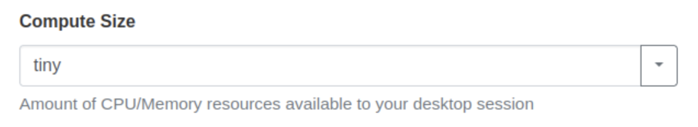
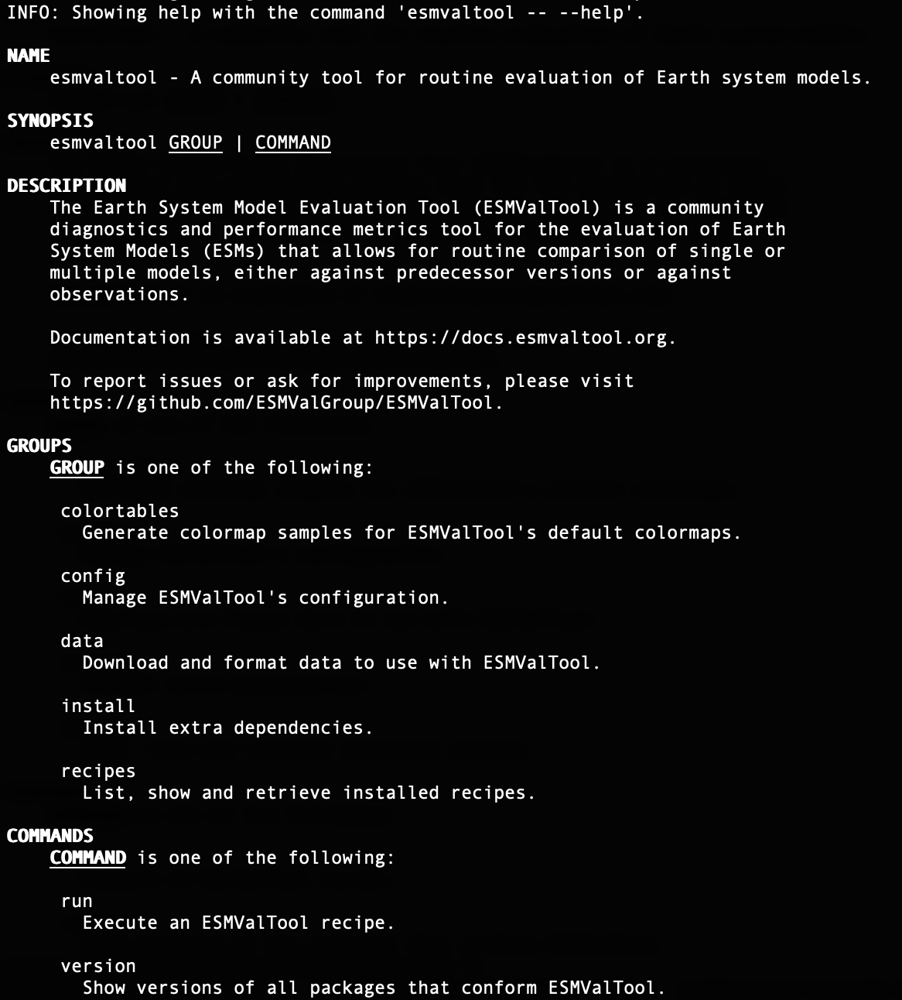

# ACCESS-NRI 2023 Workshop Introduction to ESMValTool
<p>Guide for the ESMValTool ACCESS-NRI workshop exercises.</p>

## Step 0: Pre-workshop
Join the nf33, xp65, al33, rr3 and r87 projects  

## Step 1:
Go to the [Australian Research Environment](https://are.nci.org.au/) website and login with your **NCI username and password**. If you don't have an NCI account, you can sign up for one at the [NCI website](https://my.nci.org.au/mancini/login?next=/mancini/).

<p align="center"></p>

## Step 2:
Click on `Virtual Desktop` under *Featured Apps* to configure a new VDI instance. This option is also available under the *All Apps* section at the bottom of the page and the *Interactive Apps* dropdown located in the top menu.


## Step 3:
You will now be presented with the main VDI instance configuration form. Please complete **only** the fields below - leave all other fields blank or to their default values.

- *3.1* **Walltime**: The number of hours the JupyterLab instance will run. `1` hour is sufficient for each of the tutorials.

<p align="center"></p>

- *3.2* **Compute Size**: Select `Large (7 cpus, 32G mem)` from the dropdown menu.

<p align="center"></p>

- *3.3* **Project**: Please enter `nf33`. This will allocate SU usage to the workshop project.

<p align="center"></p>

- *3.4* **Storage**: This is the list of `/g/data/` project data storage locations required to complete the workshop tutorials. In ARE, storage locations need to be explicitly defined to access these data from within a JupyterLab instance. Please enter the following string listing the projects mentioned in **Step 0** above:
```
scratch/nf33+gdata/nf33+gdata/xp65+gdata/fs38+gdata/hh5+gdata/oi10
```

<p align="center"></p>

- *3.5* Click `Advanced options ...`

- *3.6* **PBS Flags**
The **xp65** conda environment is a containerised environment that requires the `SINGULARITY_OVERLAYIMAGE` environment variable to be defined.
Copy and paste the following:
```
-v SINGULARITY_OVERLAYIMAGE=/g/data/xp65/public/apps/med_conda/envs/access-med-0.3.sqsh
```
in the **PBS Flags** field of the **advanced options** section:

<p align="center"></p>

- *3.7* Click on the **Launch** button

## Step 4

Once the VDI instance has started (this usually takes around 30 seconds) and this status window should update and look something like the following, reporting that the instance has started and the time remaining. More detailed information on the instance can be accessed by clicking the Session ID link.

<p align="center"></p>

All that remains to get started is to click `Launch VDI Desktop`.


## Step 5
Start a terminal in the VDI session.

<p align="center"></p>


Then open a terminal, change the directory to your directory in this training section

```
cd /scratch/nf33/$USER
```

## Step 6
In this directory, we need you to clone the whole repo from GitHub with the command below (if you already have this repo in your directory, you can jump to STEP 7):

```
git clone https://github.com/ACCESS-NRI/workshop-training-2023.git
```

<p align="center"></p>

Then you are all set to start the exercises.

### Step 7: Move to the `esmvaltool` training directory

In the terminal, prompt:
```bash
cd /scratch/nf33/$USER/workshop-training-2023/esmvaltool
```

### Step 8: Check the ESMValTool environment by accessing the help for ESMValTool

```bash
module use /g/data/xp65/public/modules
module load conda/access-med

esmvaltool --help
```

Prompting this help command should produce the following output:



### Step 9: The configuration file

In the next step, we want to have a look at the esmvaltool configuration file that we will use in this tutorial. You can use a text editor of your choice. In this tutorial, we use a text editor called `nano`:

```bash
nano config-user-on-gadi-v2.9.yml
```

This file contains the information for:

- Output settings
- Destination directory
- Download and auxiliary data directories
- Number of tasks that can be run in parallel
- Rootpath to input data
- Directory structure for the data from different projects

**KEY POINTS**

- The `config-user-on-gadi-v2.9.yml` tells ESMValTool where to find input data.
- `output_dir` defines the destination directory.
- `rootpath` defines the root path of the data.
- `drs` defines the directory structure of the data.

#### Output settings

The configuration file starts with output settings that inform ESMValTool about your preference for output. You can turn on or off the setting by true or false values. Most of these settings are fairly self-explanatory.

#### Destination directory

The destination directory is the rootpath where ESMValTool will store its output folders containing e.g. figures, data, logs, etc. With every run, ESMValTool automatically generates a new output folder determined by recipe name, and date and time using the format: YYYYMMDD_HHMMSS.

```yaml
# Destination directory where all output will be written
# Includes log files and performance stats.
output_dir: esmvaltool_output
```

#### Rootpath to input data

ESMValTool uses several categories (in ESMValTool, this is referred to as projects) for input data based on their source. The current categories in the configuration file are mentioned below. For example, CMIP is used for a dataset from the Climate Model Intercomparison Project whereas OBS may be used for an observational dataset. More information about the projects used in ESMValTool is available in the official <a href="https://docs.esmvaltool.org/en/latest/" target="_blank">ESMValTool documentation</a>. When using ESMValTool on your own machine, you can create a directory to download climate model data or observation data sets and let the tool use data from there. It is also possible to ask ESMValTool to download climate model data as needed. This can be done by specifying a download directory and by setting the option to download data as shown below.

#### Directories for downloading climate data and auxiliary data

```yaml
# Directory for storing downloaded climate data and find auxiliary data
download_dir: esmvaltool_climate_data
auxiliary_data_dir: /g/data/xp65/public/apps/cartopy-data
search_esgf: never
```

If you are working offline or do not want to download the data then set the option above to `never`. If you want to download data only when the necessary files are missing at the usual location, you can set the option to `when_missing`. In particular, `cartopy` will be needed as auxiliary data for several plots. We provide them through `xp65` as shown above.

The `rootpath` specifies the directories where ESMValTool will look for input data. For each category, you can define either one path or several paths as a list. For example:

```yaml
# Rootpaths to the data from different projects
# This default setting will work if files have been downloaded by the
# ESMValTool via ``offline=False``. Lists are also possible. For site-specific
# entries and more examples, see below. Comment out these when using a
# site-specific path.
rootpath:
  default: esmvaltool_climate_data
  CMIP5: [/g/data/r87/DRSv3/CMIP5, /g/data/al33/replicas/CMIP5/combined, /g/data/rr3/publications/CMIP5/output1]
  native6: /g/data/nf33/public/data/ESMValTool/obsdata
```
#### Directory structure for the data from different projects

Input data can be from various models, observations and reanalysis data that adhere to the CF/CMOR standard.

The `drs` setting describes the file structure for several projects (e.g. CMIP6, CMIP5, obs4mips, OBS6, OBS) on several key machines (e.g. BADC, CP4CDS, DKRZ, ETHZ, SMHI, BSC, NCI). For more information about `drs`, you can visit the ESMValTool documentation on <a href="https://docs.esmvaltool.org/projects/ESMValCore/en/latest/quickstart/find_data.html#data-types" target="_blank">Data types and the Data Reference Syntax (DRS)</a>.

```yaml
# Directory structure for input data --- [default]/ESGF/BADC/DKRZ/ETHZ/etc.
# This default setting will work if files have been downloaded by the
# ESMValTool via ``offline=False``. See ``config-developer.yml`` for
# definitions. Comment out/replace as per needed.
drs:
  CMIP5: BADC
```

## Step 10: The ESMValTool recipe

To see all the recipes that are shipped with ESMValTool, type

```bash
esmvaltool recipes list
```


For this tutorial, we will choose `recipe_climwip_test_basic.yml` as an example recipe.

Use the following command to copy the recipe to your working directory

```bash
esmvaltool recipes get recipe_climwip_test_basic.yml
```

Now you should see the recipe file in your working directory (type `ls` to verify). Use your text editor (e.g. nano) to open this file:

```bash
nano recipe_climwip_test_basic.yml
```
Have a look at the recipe structure:

- Documentation with relevant (citation) information
- Datasets that should be analysed
- Preprocessors groups of common preprocessing steps
- Diagnostics scripts performing more specific evaluation steps

## Step 11: Run a recipe inside a PBS Job

Because of the computational costs, we will submit a job to Gadi through the Portable Batch System. To do so, you need to use a submission script, for example the one that we already provide. Open the `launch_recipe_climwip_test_basic.pbs` file:

```bash
#!/bin/bash -l 

# For help with PBS directives on Gadi, go to https://opus.nci.org.au/display/Help/PBS+Directives+Explained
#PBS -S /bin/bash
#PBS -P nf33
#PBS -l storage=gdata/rr3+gdata/xp65+gdata/al33+gdata/nf33+scratch/nf33
#PBS -N recipe_climwip_test_basic
#PBS -l wd
#PBS -q normal
#PBS -l walltime=01:00:00
#PBS -l mem=64GB
#PBS -l ncpus=10

module use /g/data/xp65/public/modules
module load conda/access-med

esmvaltool run --config_file config-user-on-gadi-v2.9.yml recipe_climwip_test_basic.yml
```

Submit the job to the queue system:

```bash
qsub launch_recipe_climwip_test_basic.pbs
```

To monitor the progress, you can use the status prompt for the job ID
```
qstat
```

## Step 12: Investigating the log messages

Once the job is finished, you can open the log message (`recipe_climwip_test_basic.o*`) and check a few things:

After the banner and general information, the output starts with some important locations.

- Did ESMValTool use the right config file?
- What is the path to the example recipe?
- What is the main output folder generated by ESMValTool?
- Can you guess what the different output directories are for?
- ESMValTool creates two log files. What is the difference?

## Step 13: Visualise outputs with a VDI

Open a new terminal (top left of the VDI screen) and navigate to the `esmvaltool_output` directory, them use the commmand below to start a local  HTTP server.

```bash
cd /scratch/nf33/$USER/workshop-training-2023/esmvaltool/esmvaltool_output
python3 -m http.server
```

You can then start Firefox in the VDI screen and access the following localhost address to navigate into your specific `recipe*` directory and its `index.html`:

```
http://0.0.0.0:8000/
```

From there you can navigate to through the different directories to show the different evaluation plots:


