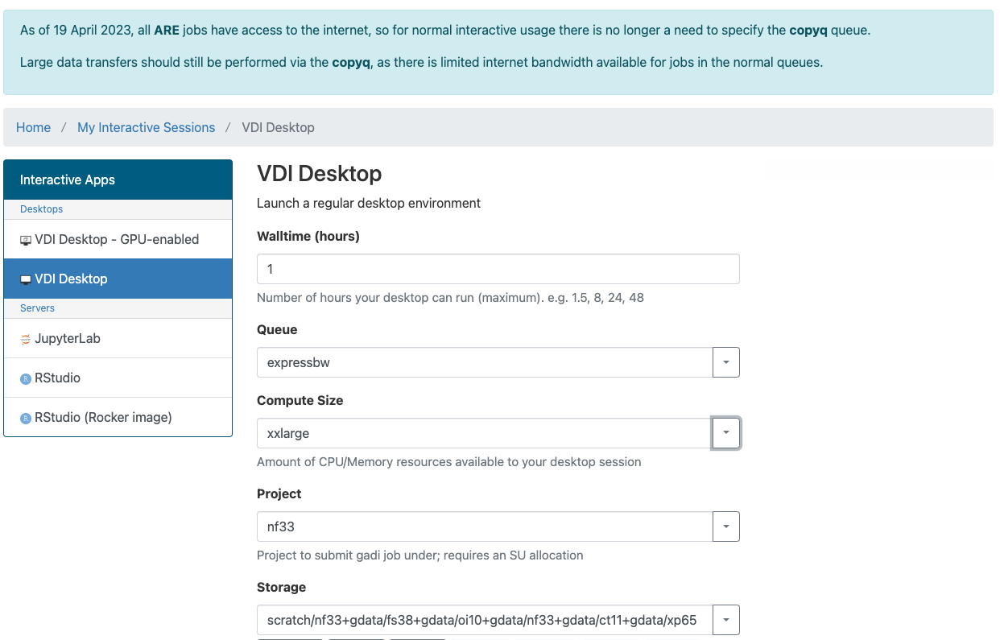
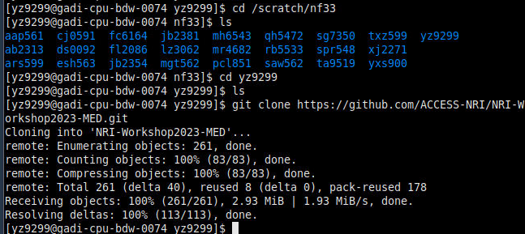

# ACCESS-NRI 2023 Workshop ILAMB Tutorial

This tutorial teaches you how to run ILAMB on ARE in the training section.

## STEP 1

First is to open ARE(Australian Research Environment) by this [link](https://are.nci.org.au). 


Use your NCI username and password to log in

## STEP 2

After logging in, you will see the dashboard page.


ARE provides a range of applications. In this section, we will use a **Virtual Desktop Instance (VDI)**:

<p align="center">
  
</p>

## STEP 3

The next step is to initialise the VDI before launching it.


One thing need to be added in `Advanced options`. just copy the command below and paste in `PBS flags`
```
-v SINGULARITY_OVERLAYIMAGE=/g/data/xp65/public/apps/med_conda/envs/access-med-0.3.sqsh
```


It is similar to submitting a PBS job if you are familiar with it. In this part you just follow this picture to initialize your VDI environment, then click launch at the bottom.

## STEP 4
Click the Launch button and you will be redirected to this page:

 

Maybe you will be in the queue for a while, it depends on what kind of queue and how much resources you apply for. When the status at the top right turns to running, you can click `Launch VDI Desktop` to access your VDI.

## STEP 5
This is the Desktop of your VDI:


Then open a terminal, change the directory to your directory in this training section

```
cd /scratch/nf33/$USER
```

## STEP 6
In this directory, we need you to clone the whole repo from GitHub with the command below (if you already have this repo in your directory, you can jump to STEP 7):

```
git clone https://github.com/ACCESS-NRI/workshop-training-2023.git
```



Then you are all set to start the exercises.

## STEP 7

```
cd ./workshop-training-2023/ilamb
```
Go to the `ilamb` directory. You will see everything we need to run ILAMB on NCI. We have got everything set up so you don't need to organise anything, just use the command below to trigger ILAMB.

```
qsub run_ilamb.pbs
```


## STEP 8

After the process terminates, you can find details about the ILAMB running process in the output log file created by PBS.


You should now see an `ilamb_result` directory which contains all the results created by ILAMB.

Let's move into the directory:

```
cd ./ilamb_result/workshop
```

Launch an **http.server** using python:

```
python3 -m http.server
```

You can then start Firefox on the VDI screen and access the following address:
localhost address:

```
http://0.0.0.0:8000/
```

In this training, we use two datasets as an example to show you how to use ILAMB.
The output should look like this:


You can browse the output by clicking on the links:


# END

You can find more details in [ilamb_tutorial](https://www.ilamb.org/doc/tutorial.html) and ACCESS-NRI tutorial about [how to use ilamb on NCI](https://ilamb-workflow.readthedocs.io/en/latest/) 
