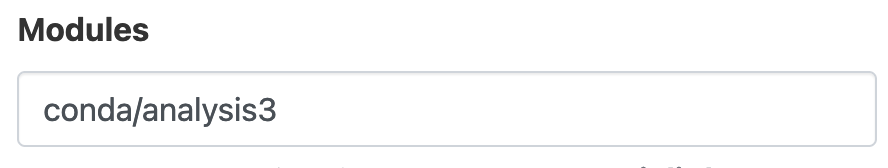

# Setting up an ARE JupyterLab session for the Intake tutorial notebooks

Quick-start guide to setting up a JupyterLab session using the Australian Research Environment to run the ACCESS-NRI workshop Intake exercises.

## Step 0: Pre-requisites
- *0.0* You should have already joined the following NCI projects: `xp65`, `hh5`, `dk92`, `fs38` and `p73`. If this is not the case, please talk to a helper.

- *0.1* You should have already cloned the [workshop-training-2023](https://github.com/ACCESS-NRI/workshop-training-2023/tree/main) to your user directory within `/scratch/nf33` on Gadi. If not, follow [these instructions](https://github.com/ACCESS-NRI/workshop-training-2023/tree/main#cloning-this-repo). 

## Step 1:
Go to the [Australian Research Environment](https://are.nci.org.au/) website and log in with your **NCI username and password**.

## Step 2:
Click on `JupyterLab` under *Featured Apps* to configure a new JupyterLab instance. This option is also available under the *All Apps* section at the bottom of the page and the *Interactive Apps* dropdown located in the top menu.

## Step 3:
You will now be presented with the main JupyterLab instance configuration form. Please complete **only** the fields below - leave all other fields blank or to their default values.

- *3.1* **Walltime**: The number of hours the JupyterLab instance will run. `1` hour is sufficient for the Intake tutorials.

- *3.2* **Compute Size**: Select `Large (7 cpus, 32G mem)` from the dropdown menu.

- *3.3* **Project**: Please enter `nf33`. This will allocate SU usage to the workshop project.

- *3.4* **Storage**: This is the list of `/g/data/` project data storage locations required to complete the workshop tutorials. In ARE, storage locations need to be explicitly defined to access these data from within a JupyterLab instance. Please enter the following string listing the projects mentioned in **Step 0** above: `scratch/nf33+gdata/xp65+gdata/hh5+gdata/dk92+gdata/fs38+gdata/p73`.

- *3.5* Click `Advanced options ...`
  * Optional: You can check the box here to receive an email notification when your JupyterLab instance starts, but as we are only running relatively small instances, they will spin up quickly and this probably isn't necessary.

- *3.6* **Extra arguments**: By default, the working directory of your JupyterLab instance will be your home directory. Add the extra argument `--notebook-dir=/scratch/nf33/$USER` to set the working directory to your user directory in `/scratch/nf33`.

- *3.7* **Module directories / Modules**: There are two pubic `conda` environments that can be used to run the tutorials, available in the projects `hh5` or `xp65`. Enter `/g/data/hh5/public/modules` into the **Module directories** field and `conda/analysis3-unstable` into the **Modules** field to use the [hh5 conda environment](http://climate-cms.wikis.unsw.edu.au/Conda#Conda_Python_Environments) (alternatively, you could use the `xp65` environment by entering `/g/data/xp65/public/modules` and `conda/access-med`, respectively). Please note, this will not work unless you have both joined the project **and** added it to storage (Step 3.4).  

- *3.8* Click `Launch` to start your JupyterLab instance.

## Step 4:
Once you have clicked `Launch` the browser will redirect to the 'interactive sessions' page where you will see your JupyterLab instance details and current status which will look something like this:

Once the JupyterLab instance has started (this usually takes around 30 seconds) and this status window should update and look something like the following, reporting that the instance has started and the time remaining. More detailed information on the instance can be accessed by clicking the `Session ID` link.

All that remains to get started is to click `Open JupyterLab`. This opens the instance a new browser window. Use the navigation tools in the left-hand panel to navigate to the location of the cloned tutorial files (`/scratch/nf33/$USER/intake`) and open the tutorial notebooks.
